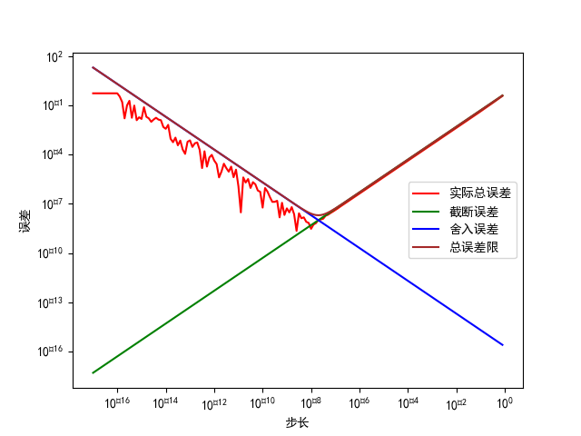

第一章
1-1

1-3
(1): 
运行结果N=2097152
理论上在2/N < epsilon * sum(1/n)停止, 计算得到大致在2200000附近，与运行相近，实际的N更小可能因为截断误差导致
(2):
单精度15.403683
双精度15.13330628383386
误差: -0.2703764249063738, 1.786631551858586%
(3):
将调和级数近似为ln(x)+欧拉常数, 进行一百次二分搜索, 得到 N > 522654032224110.6
约等于5.22654*10^14
假设我的电脑一秒能运行10^8浮点数运算，也需要大约600天才能完成