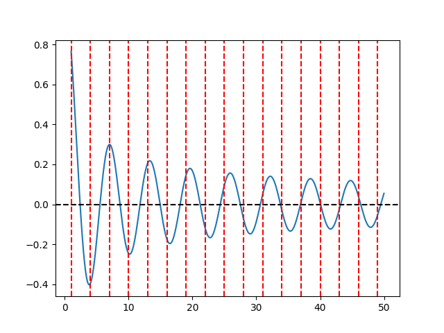
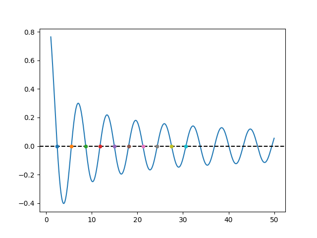

第二章
2-2
牛顿法
```
xk: 0, xk+1: 1.0, k:0
xk: 1.0, xk+1: 0.0, k:1
xk: 0.0, xk+1: 1.0, k:2
xk: 1.0, xk+1: 0.0, k:3
xk: 0.0, xk+1: 1.0, k:4
xk: 1.0, xk+1: 0.0, k:5
xk: 0.0, xk+1: 1.0, k:6
xk: 1.0, xk+1: 0.0, k:7
xk: 0.0, xk+1: 1.0, k:8
xk: 1.0, xk+1: 0.0, k:9
xk: 0.0, xk+1: 1.0, k:10
xk: 1.0, xk+1: 0.0, k:11
xk: 0.0, xk+1: 1.0, k:12
xk: 1.0, xk+1: 0.0, k:13
xk: 0.0, xk+1: 1.0, k:14
xk: 1.0, xk+1: 0.0, k:15
xk: 0.0, xk+1: 1.0, k:16
xk: 1.0, xk+1: 0.0, k:17
xk: 0.0, xk+1: 1.0, k:18
xk: 1.0, xk+1: 0.0, k:19
xk: 0.0, xk+1: 1.0, k:20
xk: 1.0, xk+1: 0.0, k:21
xk: 0.0, xk+1: 1.0, k:22
xk: 1.0, xk+1: 0.0, k:23
xk: 0.0, xk+1: 1.0, k:24
xk: 1.0, xk+1: 0.0, k:25
xk: 0.0, xk+1: 1.0, k:26
xk: 1.0, xk+1: 0.0, k:27
xk: 0.0, xk+1: 1.0, k:28
xk: 1.0, xk+1: 0.0, k:29
xk: 0.0, xk+1: 1.0, k:30
xk: 1.0, xk+1: 0.0, k:31
xk: 0.0, xk+1: 1.0, k:32
xk: 1.0, xk+1: 0.0, k:33
xk: 0.0, xk+1: 1.0, k:34
xk: 1.0, xk+1: 0.0, k:35
xk: 0.0, xk+1: 1.0, k:36
xk: 1.0, xk+1: 0.0, k:37
xk: 0.0, xk+1: 1.0, k:38
xk: 1.0, xk+1: 0.0, k:39
xk: 0.0, xk+1: 1.0, k:40
xk: 1.0, xk+1: 0.0, k:41
xk: 0.0, xk+1: 1.0, k:42
xk: 1.0, xk+1: 0.0, k:43
xk: 0.0, xk+1: 1.0, k:44
xk: 1.0, xk+1: 0.0, k:45
xk: 0.0, xk+1: 1.0, k:46
xk: 1.0, xk+1: 0.0, k:47
xk: 0.0, xk+1: 1.0, k:48
xk: 1.0, xk+1: 0.0, k:49
xk: 0.0, xk+1: 1.0, k:50
xk: 1.0, xk+1: 0.0, k:51
xk: 0.0, xk+1: 1.0, k:52
xk: 1.0, xk+1: 0.0, k:53
xk: 0.0, xk+1: 1.0, k:54
xk: 1.0, xk+1: 0.0, k:55
xk: 0.0, xk+1: 1.0, k:56
xk: 1.0, xk+1: 0.0, k:57
xk: 0.0, xk+1: 1.0, k:58
xk: 1.0, xk+1: 0.0, k:59
xk: 0.0, xk+1: 1.0, k:60
xk: 1.0, xk+1: 0.0, k:61
xk: 0.0, xk+1: 1.0, k:62
xk: 1.0, xk+1: 0.0, k:63
xk: 0.0, xk+1: 1.0, k:64
xk: 1.0, xk+1: 0.0, k:65
xk: 0.0, xk+1: 1.0, k:66
xk: 1.0, xk+1: 0.0, k:67
xk: 0.0, xk+1: 1.0, k:68
xk: 1.0, xk+1: 0.0, k:69
xk: 0.0, xk+1: 1.0, k:70
xk: 1.0, xk+1: 0.0, k:71
xk: 0.0, xk+1: 1.0, k:72
xk: 1.0, xk+1: 0.0, k:73
xk: 0.0, xk+1: 1.0, k:74
xk: 1.0, xk+1: 0.0, k:75
xk: 0.0, xk+1: 1.0, k:76
xk: 1.0, xk+1: 0.0, k:77
xk: 0.0, xk+1: 1.0, k:78
xk: 1.0, xk+1: 0.0, k:79
xk: 0.0, xk+1: 1.0, k:80
xk: 1.0, xk+1: 0.0, k:81
xk: 0.0, xk+1: 1.0, k:82
xk: 1.0, xk+1: 0.0, k:83
xk: 0.0, xk+1: 1.0, k:84
xk: 1.0, xk+1: 0.0, k:85
xk: 0.0, xk+1: 1.0, k:86
xk: 1.0, xk+1: 0.0, k:87
xk: 0.0, xk+1: 1.0, k:88
xk: 1.0, xk+1: 0.0, k:89
xk: 0.0, xk+1: 1.0, k:90
xk: 1.0, xk+1: 0.0, k:91
xk: 0.0, xk+1: 1.0, k:92
xk: 1.0, xk+1: 0.0, k:93
xk: 0.0, xk+1: 1.0, k:94
xk: 1.0, xk+1: 0.0, k:95
xk: 0.0, xk+1: 1.0, k:96
xk: 1.0, xk+1: 0.0, k:97
xk: 0.0, xk+1: 1.0, k:98
xk: 1.0, xk+1: 0.0, k:99
100轮不收敛
res1, newton:  None
```
设置阻尼系数为0.95, 每次除以2
```
xk: 0.816496584070696, xk+1: -59187986.16156977, k:23
xk: 0.8164965841, fx: -177775335002063494971392.0000000000, i:1, lambda:0.9500000000
xk: 0.8164965841, fx: -22221915907203027435520.0000000000, i:2, lambda:0.4750000000
xk: 0.8164965841, fx: -2777739246386651594752.0000000000, i:3, lambda:0.2375000000
xk: 0.8164965841, fx: -347217345294900068352.0000000000, i:4, lambda:0.1187500000
xk: 0.8164965841, fx: -43402153036004614144.0000000000, i:5, lambda:0.0593750000
xk: 0.8164965841, fx: -5425265348036105216.0000000000, i:6, lambda:0.0296875000
xk: 0.8164965841, fx: -678157223138395392.0000000000, i:7, lambda:0.0148437500
xk: 0.8164965841, fx: -84769416550769984.0000000000, i:8, lambda:0.0074218750
xk: 0.8164965841, fx: -10596117983463890.0000000000, i:9, lambda:0.0037109375
xk: 0.8164965841, fx: -1324499976587395.7500000000, i:10, lambda:0.0018554687
xk: 0.8164965841, fx: -165558804237026.2187500000, i:11, lambda:0.0009277344
xk: 0.8164965841, fx: -20693927320528.1171875000, i:12, lambda:0.0004638672
xk: 0.8164965841, fx: -2586510112790.3759765625, i:13, lambda:0.0002319336
xk: 0.8164965841, fx: -323256063529.2894287109, i:14, lambda:0.0001159668
xk: 0.8164965841, fx: -40392582798.1862487793, i:15, lambda:0.0000579834
xk: 0.8164965841, fx: -5045466563.4314918518, i:16, lambda:0.0000289917
xk: 0.8164965841, fx: -629781748.2454283237, i:17, lambda:0.0000144958
xk: 0.8164965841, fx: -78497324.8867385387, i:18, lambda:0.0000072479
xk: 0.8164965841, fx: -9755816.6017930601, i:19, lambda:0.0000036240
xk: 0.8164965841, fx: -1205389.2248969469, i:20, lambda:0.0000018120
xk: 0.8164965841, fx: -147151.0924651397, i:21, lambda:0.0000009060
xk: 0.8164965841, fx: -17512.6483310609, i:22, lambda:0.0000004530
xk: 0.8164965841, fx: -1968.1734191980, i:23, lambda:0.0000002265
xk: 0.8164965841, fx: -190.1967064006, i:24, lambda:0.0000001132
xk: 0.8164965841, fx: -9.2202800779, i:25, lambda:0.0000000566
xk: 0.8164965841, fx: 3.0841075278, i:26, lambda:0.0000000283
xk: 0.8164965841, fx: 2.0427395622, i:27, lambda:0.0000000142
xk: 0.8164965841, fx: 1.2677144649, i:28, lambda:0.0000000071
xk: 0.8164965841, fx: 1.0096228035, i:29, lambda:0.0000000035
xk: 0.8164965841, fx: 0.9370579654, i:30, lambda:0.0000000018
xk: 0.8164965841, fx: 0.9179115158, i:31, lambda:0.0000000009
xk: 0.8164965841, fx: 0.9129992485, i:32, lambda:0.0000000004
xk: 0.8164965841, fx: 0.9117554749, i:33, lambda:0.0000000002
xk: 0.8164965841, fx: 0.9114425682, i:34, lambda:0.0000000001
xk: 0.8164965841, fx: 0.9113640962, i:35, lambda:0.0000000001
xk: 0.8164965841, fx: 0.9113444475, i:36, lambda:0.0000000000
xk: 0.8164965841, fx: 0.9113395315, i:37, lambda:0.0000000000
xk: 0.8164965841, fx: 0.9113383020, i:38, lambda:0.0000000000
xk: 0.8164965841, fx: 0.9113379946, i:39, lambda:0.0000000000
xk: 0.8164965841, fx: 0.9113379177, i:40, lambda:0.0000000000
xk: 0.8164965841, fx: 0.9113378985, i:41, lambda:0.0000000000
xk: 0.8164965841, fx: 0.9113378937, i:42, lambda:0.0000000000
xk: 0.8164965841, fx: 0.9113378925, i:43, lambda:0.0000000000
xk: 0.8164965841, fx: 0.9113378922, i:44, lambda:0.0000000000
xk: 0.8164965841, fx: 0.9113378921, i:45, lambda:0.0000000000
xk: 0.8164965841, fx: 0.9113378921, i:46, lambda:0.0000000000
xk: 0.8164965841, fx: 0.9113378921, i:47, lambda:0.0000000000
xk: 0.8164965841, fx: 0.9113378921, i:48, lambda:0.0000000000
xk: 0.8164965841, fx: 0.9113378921, i:49, lambda:0.0000000000
xk: 0.8164965841, fx: 0.9113378921, i:50, lambda:0.0000000000
xk: 0.8164965841, fx: 0.9113378921, i:51, lambda:0.0000000000
xk: 0.8164965841, fx: 0.9113378921, i:52, lambda:0.0000000000
xk: 0.8164965841, fx: 0.9113378921, i:53, lambda:0.0000000000
xk: 0.8164965841, fx: 0.9113378921, i:54, lambda:0.0000000000
xk: 0.8164965778280687, xk+1: 60015044.29209838, k:24
xk: 0.8164965778, fx: 185332340209422052622336.0000000000, i:1, lambda:0.9500000000
xk: 0.8164965778, fx: 23166543521475668738048.0000000000, i:2, lambda:0.4750000000
xk: 0.8164965778, fx: 2895818189008939253760.0000000000, i:3, lambda:0.2375000000
xk: 0.8164965778, fx: 361977335832237572096.0000000000, i:4, lambda:0.1187500000
xk: 0.8164965778, fx: 45247182530559721472.0000000000, i:5, lambda:0.0593750000
xk: 0.8164965778, fx: 5655901704202471424.0000000000, i:6, lambda:0.0296875000
xk: 0.8164965778, fx: 706988684995935488.0000000000, i:7, lambda:0.0148437500
xk: 0.8164965778, fx: 88373828617148608.0000000000, i:8, lambda:0.0074218750
xk: 0.8164965778, fx: 11046789325307746.0000000000, i:9, lambda:0.0037109375
xk: 0.8164965778, fx: 1380863852704510.5000000000, i:10, lambda:0.0018554687
xk: 0.8164965778, fx: 172611778348325.0312500000, i:11, lambda:0.0009277344
xk: 0.8164965778, fx: 21577421483606.5234375000, i:12, lambda:0.0004638672
xk: 0.8164965778, fx: 2697414982967.8891601562, i:13, lambda:0.0002319336
xk: 0.8164965778, fx: 337236197250.8524169922, i:14, lambda:0.0001159668
xk: 0.8164965778, fx: 42169355751.9211730957, i:15, lambda:0.0000579834
xk: 0.8164965778, fx: 5274877243.4793567657, i:16, lambda:0.0000289917
xk: 0.8164965778, fx: 660286599.6552826166, i:17, lambda:0.0000144958
xk: 0.8164965778, fx: 82767561.6100641191, i:18, lambda:0.0000072479
xk: 0.8164965778, fx: 10403879.9626107197, i:19, lambda:0.0000036240
xk: 0.8164965778, fx: 1314969.2837293874, i:20, lambda:0.0000018120
xk: 0.8164965778, fx: 167992.8306321175, i:21, lambda:0.0000009060
xk: 0.8164965778, fx: 21905.1194358376, i:22, lambda:0.0000004530
xk: 0.8164965778, fx: 2965.2418965997, i:23, lambda:0.0000002265
xk: 0.8164965778, fx: 428.0287943079, i:24, lambda:0.0000001132
xk: 0.8164965778, fx: 68.4450540691, i:25, lambda:0.0000000566
xk: 0.8164965778, fx: 12.8890609358, i:26, lambda:0.0000000283
xk: 0.8164965778, fx: 3.2925553981, i:27, lambda:0.0000000142
xk: 0.8164965778, fx: 1.4299906093, i:28, lambda:0.0000000071
xk: 0.8164965778, fx: 1.0314196128, i:29, lambda:0.0000000035
xk: 0.8164965778, fx: 0.9401606393, i:30, lambda:0.0000000018
xk: 0.8164965778, fx: 0.9183938682, i:31, lambda:0.0000000009
xk: 0.8164965778, fx: 0.9130831721, i:32, lambda:0.0000000004
xk: 0.8164965778, fx: 0.9117718728, i:33, lambda:0.0000000002
xk: 0.8164965778, fx: 0.9114460948, i:34, lambda:0.0000000001
xk: 0.8164965778, fx: 0.9113649062, i:35, lambda:0.0000000001
xk: 0.8164965778, fx: 0.9113446410, i:36, lambda:0.0000000000
xk: 0.8164965778, fx: 0.9113395788, i:37, lambda:0.0000000000
xk: 0.8164965778, fx: 0.9113383137, i:38, lambda:0.0000000000
xk: 0.8164965778, fx: 0.9113379975, i:39, lambda:0.0000000000
xk: 0.8164965778, fx: 0.9113379184, i:40, lambda:0.0000000000
xk: 0.8164965778, fx: 0.9113378987, i:41, lambda:0.0000000000
xk: 0.8164965778, fx: 0.9113378937, i:42, lambda:0.0000000000
xk: 0.8164965778, fx: 0.9113378925, i:43, lambda:0.0000000000
xk: 0.8164965778, fx: 0.9113378922, i:44, lambda:0.0000000000
xk: 0.8164965778, fx: 0.9113378921, i:45, lambda:0.0000000000
xk: 0.8164965778, fx: 0.9113378921, i:46, lambda:0.0000000000
xk: 0.8164965778, fx: 0.9113378921, i:47, lambda:0.0000000000
xk: 0.8164965778, fx: 0.9113378921, i:48, lambda:0.0000000000
xk: 0.8164965778, fx: 0.9113378921, i:49, lambda:0.0000000000
xk: 0.8164965778, fx: 0.9113378921, i:50, lambda:0.0000000000
xk: 0.8164965778, fx: 0.9113378921, i:51, lambda:0.0000000000
xk: 0.8164965778, fx: 0.9113378921, i:52, lambda:0.0000000000
xk: 0.8164965778, fx: 0.9113378921, i:53, lambda:0.0000000000
xk: 0.8164965778, fx: 0.9113378921, i:54, lambda:0.0000000000
xk: 0.8164965841579266, xk+1: -57589634.24793698, k:25
xk: 0.8164965842, fx: -163758471449088169607168.0000000000, i:1, lambda:0.9500000000
xk: 0.8164965842, fx: -20469808014659155918848.0000000000, i:2, lambda:0.4750000000
xk: 0.8164965842, fx: -2558725772713179742208.0000000000, i:3, lambda:0.2375000000
xk: 0.8164965842, fx: -319840664309343715328.0000000000, i:4, lambda:0.1187500000
xk: 0.8164965842, fx: -39980068718717050880.0000000000, i:5, lambda:0.0593750000
xk: 0.8164965842, fx: -4997505009851901952.0000000000, i:6, lambda:0.0296875000
xk: 0.8164965842, fx: -624687231234555008.0000000000, i:7, lambda:0.0148437500
xk: 0.8164965842, fx: -78085680155086272.0000000000, i:8, lambda:0.0074218750
xk: 0.8164965842, fx: -9760654082077500.0000000000, i:9, lambda:0.0037109375
xk: 0.8164965842, fx: -1220067775932616.0000000000, i:10, lambda:0.0018554687
xk: 0.8164965842, fx: -152504975909808.5625000000, i:11, lambda:0.0009277344
xk: 0.8164965842, fx: -19062247968283.3554687500, i:12, lambda:0.0004638672
xk: 0.8164965842, fx: -2382562490924.1420898438, i:13, lambda:0.0002319336
xk: 0.8164965842, fx: -297765685087.1006469727, i:14, lambda:0.0001159668
xk: 0.8164965842, fx: -37207054065.6852416992, i:15, lambda:0.0000579834
xk: 0.8164965842, fx: -4647467615.0620145798, i:16, lambda:0.0000289917
xk: 0.8164965842, fx: -580079915.4975310564, i:17, lambda:0.0000144958
xk: 0.8164965842, fx: -72296604.7428231984, i:18, lambda:0.0000072479
xk: 0.8164965842, fx: -8983728.8211965971, i:19, lambda:0.0000036240
xk: 0.8164965842, fx: -1109628.8116706270, i:20, lambda:0.0000018120
xk: 0.8164965842, fx: -135368.6806489094, i:21, lambda:0.0000009060
xk: 0.8164965842, fx: -16086.7568132970, i:22, lambda:0.0000004530
xk: 0.8164965842, fx: -1801.6644692937, i:23, lambda:0.0000002265
xk: 0.8164965842, fx: -172.3149601166, i:24, lambda:0.0000001132
xk: 0.8164965842, fx: -7.7180299060, i:25, lambda:0.0000000566
xk: 0.8164965842, fx: 3.0886467709, i:26, lambda:0.0000000283
xk: 0.8164965842, fx: 1.9974964605, i:27, lambda:0.0000000142
xk: 0.8164965842, fx: 1.2506064504, i:28, lambda:0.0000000071
xk: 0.8164965842, fx: 1.0046211450, i:29, lambda:0.0000000035
xk: 0.8164965842, fx: 0.9357169689, i:30, lambda:0.0000000018
xk: 0.8164965842, fx: 0.9175649439, i:31, lambda:0.0000000009
xk: 0.8164965842, fx: 0.9129111902, i:32, lambda:0.0000000004
xk: 0.8164965842, fx: 0.9117332835, i:33, lambda:0.0000000002
xk: 0.8164965842, fx: 0.9114369983, i:34, lambda:0.0000000001
xk: 0.8164965842, fx: 0.9113627009, i:35, lambda:0.0000000001
xk: 0.8164965842, fx: 0.9113440983, i:36, lambda:0.0000000000
xk: 0.8164965842, fx: 0.9113394442, i:37, lambda:0.0000000000
xk: 0.8164965842, fx: 0.9113382802, i:38, lambda:0.0000000000
xk: 0.8164965842, fx: 0.9113379891, i:39, lambda:0.0000000000
xk: 0.8164965842, fx: 0.9113379164, i:40, lambda:0.0000000000
xk: 0.8164965842, fx: 0.9113378982, i:41, lambda:0.0000000000
xk: 0.8164965842, fx: 0.9113378936, i:42, lambda:0.0000000000
xk: 0.8164965842, fx: 0.9113378925, i:43, lambda:0.0000000000
xk: 0.8164965842, fx: 0.9113378922, i:44, lambda:0.0000000000
xk: 0.8164965842, fx: 0.9113378921, i:45, lambda:0.0000000000
xk: 0.8164965842, fx: 0.9113378921, i:46, lambda:0.0000000000
xk: 0.8164965842, fx: 0.9113378921, i:47, lambda:0.0000000000
xk: 0.8164965842, fx: 0.9113378921, i:48, lambda:0.0000000000
xk: 0.8164965842, fx: 0.9113378921, i:49, lambda:0.0000000000
xk: 0.8164965842, fx: 0.9113378921, i:50, lambda:0.0000000000
xk: 0.8164965842, fx: 0.9113378921, i:51, lambda:0.0000000000
xk: 0.8164965842, fx: 0.9113378921, i:52, lambda:0.0000000000
xk: 0.8164965842, fx: 0.9113378921, i:53, lambda:0.0000000000
xk: 0.8164965842, fx: 0.9113378921, i:54, lambda:0.0000000000
xk: 0.8164965780838794, xk+1: 65413539.55666149, k:26
xk: 0.8164965781, fx: 239979290855053771931648.0000000000, i:1, lambda:0.9500000000
xk: 0.8164965781, fx: 29997412539291830059008.0000000000, i:2, lambda:0.4750000000
xk: 0.8164965781, fx: 3749676863014007996416.0000000000, i:3, lambda:0.2375000000
xk: 0.8164965781, fx: 468709681777382981632.0000000000, i:4, lambda:0.1187500000
xk: 0.8164965781, fx: 58588728697330900992.0000000000, i:5, lambda:0.0593750000
xk: 0.8164965781, fx: 7323595705955867648.0000000000, i:6, lambda:0.0296875000
xk: 0.8164965781, fx: 915450617941859840.0000000000, i:7, lambda:0.0148437500
xk: 0.8164965781, fx: 114431615917076624.0000000000, i:8, lambda:0.0074218750
xk: 0.8164965781, fx: 14304024158220604.0000000000, i:9, lambda:0.0037109375
xk: 0.8164965781, fx: 1788021061924083.5000000000, i:10, lambda:0.0018554687
xk: 0.8164965781, fx: 223507143277137.9062500000, i:11, lambda:0.0009277344
xk: 0.8164965781, fx: 27939520543799.7265625000, i:12, lambda:0.0004638672
xk: 0.8164965781, fx: 3492721976514.9331054688, i:13, lambda:0.0002319336
xk: 0.8164965781, fx: 436660724199.9567260742, i:14, lambda:0.0001159668
xk: 0.8164965781, fx: 54600209809.4901275635, i:15, lambda:0.0000579834
xk: 0.8164965781, fx: 6829431047.9082088470, i:16, lambda:0.0000289917
xk: 0.8164965781, fx: 854780087.0170723200, i:17, lambda:0.0000144958
xk: 0.8164965781, fx: 107122812.9823336452, i:18, lambda:0.0000072479
xk: 0.8164965781, fx: 13459177.7471558489, i:19, lambda:0.0000036240
xk: 0.8164965781, fx: 1699604.3475503908, i:20, lambda:0.0000018120
xk: 0.8164965781, fx: 216752.9237979582, i:21, lambda:0.0000009060
xk: 0.8164965781, fx: 28170.3086286215, i:22, lambda:0.0000004530
xk: 0.8164965781, fx: 3790.9349324611, i:23, lambda:0.0000002265
xk: 0.8164965781, fx: 541.8765204815, i:24, lambda:0.0000001132
xk: 0.8164965781, fx: 85.3350440135, i:25, lambda:0.0000000566
xk: 0.8164965781, fx: 15.6650657220, i:26, lambda:0.0000000283
xk: 0.8164965781, fx: 3.8057450072, i:27, lambda:0.0000000142
xk: 0.8164965781, fx: 1.5356865632, i:28, lambda:0.0000000071
xk: 0.8164965781, fx: 1.0550184202, i:29, lambda:0.0000000035
xk: 0.8164965781, fx: 0.9457071936, i:30, lambda:0.0000000018
xk: 0.8164965781, fx: 0.9197363633, i:31, lambda:0.0000000009
xk: 0.8164965781, fx: 0.9134132780, i:32, lambda:0.0000000004
xk: 0.8164965781, fx: 0.9118537095, i:33, lambda:0.0000000002
xk: 0.8164965781, fx: 0.9114664678, i:34, lambda:0.0000000001
xk: 0.8164965781, fx: 0.9113699887, i:35, lambda:0.0000000001
xk: 0.8164965781, fx: 0.9113459103, i:36, lambda:0.0000000000
xk: 0.8164965781, fx: 0.9113398959, i:37, lambda:0.0000000000
xk: 0.8164965781, fx: 0.9113383930, i:38, lambda:0.0000000000
xk: 0.8164965781, fx: 0.9113380173, i:39, lambda:0.0000000000
xk: 0.8164965781, fx: 0.9113379234, i:40, lambda:0.0000000000
xk: 0.8164965781, fx: 0.9113378999, i:41, lambda:0.0000000000
xk: 0.8164965781, fx: 0.9113378941, i:42, lambda:0.0000000000
xk: 0.8164965781, fx: 0.9113378926, i:43, lambda:0.0000000000
xk: 0.8164965781, fx: 0.9113378922, i:44, lambda:0.0000000000
xk: 0.8164965781, fx: 0.9113378921, i:45, lambda:0.0000000000
xk: 0.8164965781, fx: 0.9113378921, i:46, lambda:0.0000000000
xk: 0.8164965781, fx: 0.9113378921, i:47, lambda:0.0000000000
xk: 0.8164965781, fx: 0.9113378921, i:48, lambda:0.0000000000
xk: 0.8164965781, fx: 0.9113378921, i:49, lambda:0.0000000000
xk: 0.8164965781, fx: 0.9113378921, i:50, lambda:0.0000000000
xk: 0.8164965781, fx: 0.9113378921, i:51, lambda:0.0000000000
xk: 0.8164965781, fx: 0.9113378921, i:52, lambda:0.0000000000
xk: 0.8164965781, fx: 0.9113378921, i:53, lambda:0.0000000000
xk: 0.8164965781, fx: 0.9113378921, i:54, lambda:0.0000000000
xk: 0.816496584983123, xk+1: -45871233.578355365, k:27
xk: 0.8164965850, fx: -82754586487717290311680.0000000000, i:1, lambda:0.9500000000
xk: 0.8164965850, fx: -10344322729512882143232.0000000000, i:2, lambda:0.4750000000
xk: 0.8164965850, fx: -1293040195826165219328.0000000000, i:3, lambda:0.2375000000
xk: 0.8164965850, fx: -161629988137534357504.0000000000, i:4, lambda:0.1187500000
xk: 0.8164965850, fx: -20203739432007704576.0000000000, i:5, lambda:0.0593750000
xk: 0.8164965850, fx: -2525465157704942592.0000000000, i:6, lambda:0.0296875000
xk: 0.8164965850, fx: -315682576889112768.0000000000, i:7, lambda:0.0148437500
xk: 0.8164965850, fx: -39460180155137848.0000000000, i:8, lambda:0.0074218750
xk: 0.8164965850, fx: -4932487030391914.0000000000, i:9, lambda:0.0037109375
xk: 0.8164965850, fx: -616552006548909.3750000000, i:10, lambda:0.0018554687
xk: 0.8164965850, fx: -77066782756093.1250000000, i:11, lambda:0.0009277344
xk: 0.8164965850, fx: -9632793328880.9121093750, i:12, lambda:0.0004638672
xk: 0.8164965850, fx: -1203960537201.8332519531, i:13, lambda:0.0002319336
xk: 0.8164965850, fx: -150460409922.5609741211, i:14, lambda:0.0001159668
xk: 0.8164965850, fx: -18798886932.8050117493, i:15, lambda:0.0000579834
xk: 0.8164965850, fx: -2347694789.1237959862, i:16, lambda:0.0000289917
xk: 0.8164965850, fx: -292920328.6732060909, i:17, lambda:0.0000144958
xk: 0.8164965850, fx: -36479660.4942706823, i:18, lambda:0.0000072479
xk: 0.8164965850, fx: -4526111.8162495578, i:19, lambda:0.0000036240
xk: 0.8164965850, fx: -557301.9425827533, i:20, lambda:0.0000018120
xk: 0.8164965850, fx: -67546.6361455518, i:21, lambda:0.0000009060
xk: 0.8164965850, fx: -7913.7047835340, i:22, lambda:0.0000004530
xk: 0.8164965850, fx: -856.2088488625, i:23, lambda:0.0000002265
xk: 0.8164965850, fx: -73.1769783850, i:24, lambda:0.0000001132
xk: 0.8164965850, fx: -0.0867748951, i:25, lambda:0.0000000566
xk: -1.780935114955016, xk+1: -1.7693885141216525, k:28
xk: -1.7693885141216525, xk+1: -1.76929236087836, k:29
xk: -1.76929236087836, xk+1: -1.7692923542386314, k:30
xk: -1.7692923542386314, xk+1: -1.7692923542386314, k:31
res1, newton_downhill:  -1.7692923542386314
```
跑了30轮。

与scipy的root方法比较，res1, scipy:  [-1.76929235] True,误差较小

第二个方程:
```
xk: 2.2360934030219455, xk+1: 2.236067977933435, k:8
xk: 2.236067977933435, xk+1: 2.23606797749979, k:9
xk: 2.23606797749979, xk+1: 2.23606797749979, k:10
res2, newton:  2.23606797749979
```

```
xk: 1.35, xk+1: 10.525668449197836, k:0
xk: 1.3500000000, fx: -969.8655903091, i:1, lambda:0.9500000000
xk: 1.3500000000, fx: -157.4748986331, i:2, lambda:0.4750000000
xk: 1.3500000000, fx: -26.3117656106, i:3, lambda:0.2375000000
xk: 1.3500000000, fx: -2.3217774787, i:4, lambda:0.1187500000
xk: 2.439610628342243, xk+1: 2.2589992391657847, k:1
xk: 2.2589992391657847, xk+1: 2.236412481990544, k:2
xk: 2.236412481990544, xk+1: 2.236068057086387, k:3
xk: 2.236068057086387, xk+1: 2.236067977499794, k:4
xk: 2.236067977499794, xk+1: 2.23606797749979, k:5
res2, newton_downhill:  2.23606797749979
```
下山法比牛顿法快一点。

2-3
使用课本第50页的函数。

观察可见，前10个根的范围分别在
    (1, 4), (4, 7), (7, 10), (10, 13), (13, 16), 
    (16, 19),(19, 22), (22, 25), (25, 28), (28, 31)

求解结果:
time: 8, root: 2.40482555769575
time: 6, root: 5.52007811078083
time: 5, root: 8.65372791290961
time: 6, root: 11.7915344390163
time: 6, root: 14.9309177084893
time: 6, root: 18.0710639679392
time: 6, root: 21.2116366299
time: 6, root: 24.35247153075
time: 6, root: 27.4934791320401
time: 6, root: 30.6346064684316

